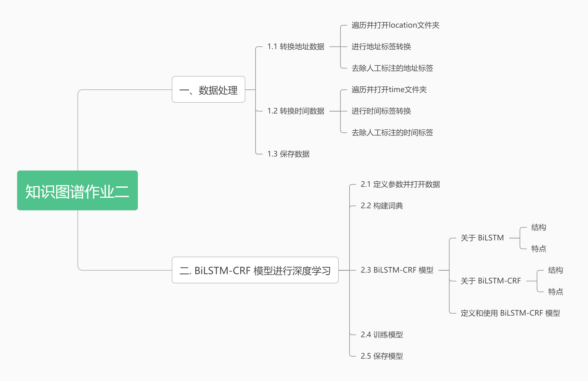
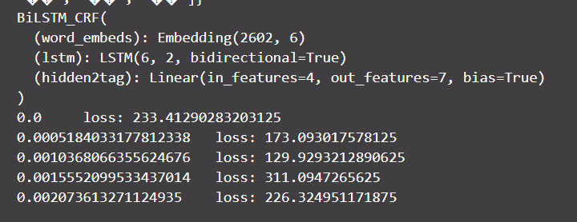

# 知识图谱作业二

**2020212185 张扬**

------

**内容**：基于给定的暴雨洪涝中文语料库，利用已人工标注的样本作为训练集合测试集，基于深度学习和预训练模型，编程实现暴雨洪涝中文文本中的发生时间和发生地点两类实体的识别和抽取。
**数据集**：见附件
**完成目标**：
（1）掌握实体识别的流程和相关模型的构建
（2）掌握训练/验证/测试的数据集分割以及超参数调整
作业要求：
（1）提交实验报告
具体包括：数据集情况、模型介绍、参数设置、实验结果（评价指标包括查全率、查准率和F1）及结果分析等内容。
（2）提交源代码
源代码请附加Readme文件说明使用的主要包的版本，以及其他可能影响代码运行的事项。

------

[TOC]



主要使用包的版本见`requirements.txt`

## 一、数据处理

数据集分为两部分`./data/location`和`./data/time`分别是暴雨洪涝中文文本中的发生时间和发生地点两类实体人工标注的数据。

编写`disopsedata.py`文件，对数据进行处理，将数据转换为`BIO`标注格式，同时将数据分为训练集和测试集。

### 1.1 转换地址数据

#### 遍历并打开location文件夹

初始化存储每一条数据的字典变量`piece`，它有两个键，`label`和`text`.

用`listdir`得到文件夹下的所有文件名称，然后遍历文件夹：

```py
"""
转换地址数据
"""    
piece = {}
files = os.listdir("./data/location")  # 得到文件夹下的所有文件名称
for file in files: # 遍历文件夹
```

打开文件,读取文件内容到`text`,去除**换行符**，初始化`label`， 标签、文本长度一致

```py
with open("./data/location/"+file, 'r', encoding='utf-8') as f: # 打开文件
    text = f.read()                 # 读取文件
    text = re.sub("\n", "", text)  # 去除换行符
    piece["label"] = list(range(len(text)))  # 标签、文本长度一致
```

#### 进行地址标签转换

先将所有标签置为O,用`human_labels_index`变量存储人工标注的标签索引,用`re.finditer`，使用正则表达式`r'\s([^\s]*)/LOC'`匹配`/LOC`，匹配到的地址**开始**的标签为**B-LOCATION**，地址**中间和结束**的标签为**I-LOCATION**，利用`m.start()`和`m.end()`将人工标注的标签索引存储到`human_labels_index`中。

```python
# 先将所有标签置为O
for i in range(len(text)): #
    piece["label"][i] = "O"

# 进行标签转换
human_labels_index = [] # 人工标注的标签索引
for m in re.finditer(r'\s([^\s]*)/LOC', text): # 1.匹配空格 2.匹配非空格内容 3.匹配/LOC
    piece["label"][m.start()+1] = "B-LOCATION" # 地址开始的标签为B-LOCATION
    for i in range(m.start()+2, m.end()-4): # 地址中间的标签为I-LOCATION
        piece["label"][i] = "I-LOCATION"
    for i in range(m.end()-4, m.end()): # 人工标注的标签索引
        human_labels_index.append(i)
```

#### 去除人工标注的地址标签

文本 -> 列表
将人工标注的标签置为空格，然后添加到数据中。

```python
# 去除人工标注的标签
piece["text"] = list(text) # 文本 -> 列表
for i in human_labels_index: 
    piece["text"][i] = " " # 将人工标注的标签置为空格
data.append(piece) # 添加到数据中
piece = {} 
```

### 1.2 转换时间数据

#### 遍历并打开time文件夹

初始化存储每一条数据的字典变量`piece`，它有两个键，`label`和`text`.

用`listdir`得到文件夹下的所有文件名称，然后遍历文件夹：

```python
"""
转换时间数据
"""
files = os.listdir("./data/time")  
    for file in files:  # 遍历文件夹
        with open("./data/time/"+file, 'r', encoding='utf-8') as f: # 打开文件
            text = f.read() # 读取文件
            text = re.sub("\n", "", text) # 去除换行符
            piece["label"] = list(range(len(text))) # 标签、文本长度一致
            human_labels_index = [] # 人工标注的标签索引
```

#### 进行时间标签转换

先将所有标签置为O,用`human_labels_index`变量存储人工标注的标签索引,用`re.finditer`，使用正则表达式`r'\s([^\s]*)/[DT][SO]'`匹配`/[DT][SO]`，匹配到的时间**开始**的标签为**B-TIME**，时间**中间和结束**的标签为**I-TIME**，利用`m.start()`和`m.end()`将人工标注的标签索引存储到`human_labels_index`中。

```python
# 先将所有标签置为O
for i in range(len(text)): 
    piece["label"][i] = "O"         # 其他标签为O

# 进行标签转换
for m in re.finditer(r'\s([^\s]*)/[DT][SO]', text): #1.匹配空格 2.匹配非空格内容 3.匹配/LOC
    piece["label"][m.start()+1] = "B-TIME"       # 时间开始的标签为B-TIME
    for i in range(m.start()+2, m.end()-3):
        piece["label"][i] = "I-TIME"            # 时间中间的标签为I-TIME
    for i in range(m.end()-3, m.end()):
        human_labels_index.append(i)           # 人工标注的标签索引
```

#### 去除人工标注的时间标签

文本 -> 列表
将人工标注的标签置为空格，然后添加到数据中。

```python
# 去除人工标注的标签
piece["text"] = list(text) # 文本
for i in human_labels_index: #
    piece["text"][i] = " " # 将人工标注的标签置为空格

data.append(piece) # 添加到数据中
piece = {} # 初始化存储每一条数据的字典变量
```

### 1.3 保存数据

将数据保存为`json`格式和`txt`格式。
遍历数据，将每一条数据的`text`和`label`分别保存到`txt`文件中。
将字典格式的数据`data`保存为`json`格式。

```python
# 保存数据为json格式
# json.dump(data, open("./data/data.json", 'w', encoding='utf-8'), ensure_ascii=False, indent=4)

# 保存数据为txt格式
with open("./data/data.txt", 'w', encoding='utf-8') as f: # 打开文件
    for piece in data: # 遍历数据
        for i in range(len(piece["text"])): # 遍历文本
            f.write(piece["text"][i] + " " + piece["label"][i] + "\n") # 写入文本和标签
        f.write("\n") # 写入换行符

return data # 返回数据
```

## 二. `BiLSTM-CRF`模型进行深度学习

### 2.1 定义参数并打开数据

`START_TAG` 是一个特殊的标签，用来表示序列的开始，`STOP_TAG` 是一个特殊的标签，用来表示序列的结束。

`EMBEDDING_DIM` 是词向量的维度，`HIDDEN_DIM` 是`BiLSTM`的隐藏层的特征数量，因为是双向所以是2倍，单向为2。

`EMBEDDING_DIM` 为6，是因为标签一共有`O`， `B-LOCATION`, `I-LOCATION`， `B-TIME`，`START_TAG` ，`STOP_TAG`6个。

然后打开`'./data/data.json'`文件，读取数据。

```python
START_TAG = "<START>"
STOP_TAG = "<STOP>"
EMBEDDING_DIM = 5 
# 由于标签一共有O， B-LOCATION, I-LOCATION， B-TIME，START_TAG ，STOP_TAG6个，所以embedding_dim为6
HIDDEN_DIM = 4 # 这其实是BiLSTM的隐藏层的特征数量，因为是双向所以是2倍，单向为2

data = json.load(open('./data/data.json', 'r', encoding='utf-8'))
print(data[1])
```

### 2.2 构建词典

`word_to_ix`是词典，`tag_to_ix`是标签字典。

遍历数据，将每一条数据的`text`中的词添加到`word_to_ix`中，如果词已经在`word_to_ix`中，则不添加。

```python

word_to_ix = {}
for piece in data:
    for word in piece["text"]:
        if word not in word_to_ix:
            word_to_ix[word] = len(word_to_ix)

tag_to_ix = {"O": 0, "B-LOCATION": 1, "I-LOCATION": 2, "B-TIME": 3, "I-TIME": 4, START_TAG: 5, STOP_TAG: 6}

```

### 2.3 `BiLSTM-CRF`模型

#### 关于`BiLSTM`

**双向长短时记忆网络**（Bidirectional Long Short-Term Memory Network，BiLSTM）是一种**循环神经网络**（Recurrent Neural Network，RNN），它可以有效地捕捉序列数据中的**上下文信息**。相对于传统的**单向LSTM**，双向LSTM在处理序列时可以同时**从前向和后向进行学习**，从而更全面地捕捉序列中的上下文信息。

##### 结构

`BiLSTM`包括两个`LSTM`层，分别从**前向**和**后向**处理输入序列，并将前向和后向的**隐状态**拼接在一起，形成最终的输出。在BiLSTM中，对于每一个**时间步**，输入序列的信息会被传递到前向和后向**两个LSTM层**中，分别计算出**前向和后向的隐状态**。具体来说，**在前向LSTM中**，当前时间步的输入和前一个时间步的前向隐状态会被输入到门控单元中，计算出当前时间步的前向隐状态。同样地，**在后向LSTM中**，当前时间步的输入和后一个时间步的后向隐状态会被输入到门控单元中，计算出当前时间步的后向隐状态。最后，将前向和后向的隐状态拼接在一起，作为BiLSTM的输出。


##### 特点

双向LSTM具有以下特点：

- **双向性**：双向LSTM可以同时从前向和后向学习序列中的信息，可以更全面地捕捉序列中的上下文信息。
- **长短时记忆单元**：LSTM包括**门控单元**，它们能够在处理序列数据时选择性地记住或遗忘先前的信息，从而能够有效地处理长期依赖关系。
- **可堆叠性**：多层双向LSTM可以通过**堆叠多个BiLSTM层**来进一步增强模型的表达能力和学习能力。

双向LSTM在自然语言处理领域得到广泛应用，如情感分析、文本分类、机器翻译、命名实体识别等任务。它可以捕捉句子中的上下文信息，从而提高模型的性能。

#### 关于`BiLSTM-CRF`

`BiLSTM-CRF`网络是一种常用于序列标注任务的深度学习模型，它的结构和特点如下：

##### `BiLSTM-CRF`结构

`BiLSTM-CRF`网络由两部分组成，即**双向长短时记忆网络**（BiLSTM）和**条件随机场**（CRF）层。`BiLSTM`层是一种具有**记忆功能的循环神经网络**，它可以有效地捕捉序列中的**上下文信息**。CRF层是一种**判别模型**，它可以考虑序列中所有标签之间的**依赖关系**，从而进行更准确的标注预测。


##### `BiLSTM-CRF`特点

`BiLSTM-CRF`网络具有以下特点：

- 双向LSTM：双向LSTM可以同时从前向和后向学习序列中的信息，可以更全面地捕捉序列中的上下文信息。
- `CRF`层：`CRF`层可以利用序列中标签之间的依赖关系进行更准确的标注预测，从而避免独立标注每个标记时可能出现的不合理标注情况。
- 损失函数：`BiLSTM-CRF`网络使用**对数似然**作为损失函数，通过**最大化对数似然**来训练模型，从而提高模型的预测准确率。
- 预测速度：`BiLSTM-CRF`网络在预测时可以利用**动态规划算法**对CRF层进行高效计算，从而提高预测速度。
- 应用场景：`BiLSTM-CRF`网络广泛应用于**自然语言处理任务**中的序列标注问题，如**命名实体识别**、词性标注、语义角色标注等。

`BiLSTM-CRF`网络通过**结合**双向LSTM和CRF层的优势，可以更好地解决**序列标注**问题，并在自然语言处理等领域得到了广泛应用。

#### 定义和使用`BiLSTM-CRF`模型

具体见`BiLSTM_CRF`类

`BiLSTM_CRF`类继承自`torch.nn.Module`，并且重写了`forward`方法。

`forward`方法的输入是`sentence_in`和`targets`，`sentence_in`是输入的句子，`targets`是输入的标签。

`forward`方法的输出是`loss`，`loss`是损失函数。

- `BiLSTM_CRF`类中定义了`neg_log_likelihood`方法，`neg_log_likelihood`方法的输入是`sentence_in`和`targets`，`sentence_in`是输入的句子，`targets`是输入的标签。
  `neg_log_likelihood`方法的输出是`loss`，`loss`是损失函数。

- `BiLSTM_CRF`类中定义了`_get_lstm_features`方法，`_get_lstm_features`方法的输入是`sentence_in`，`sentence_in`是输入的句子。
  `_get_lstm_features`方法的输出是`lstm_feats`，`lstm_feats`是`BiLSTM`的输出。

- `BiLSTM_CRF`类中定义了`_score_sentence`方法，`_score_sentence`方法的输入是`feats`和`tags`，`feats`是`BiLSTM`的输出，`tags`是输入的标签。
  `_score_sentence`方法的输出是`score`，`score`是`BiLSTM`的输出和标签的得分。

- `BiLSTM_CRF`类中定义了`_viterbi_decode`方法，`_viterbi_decode`方法的输入是`feats`，`feats`是`BiLSTM`的输出。
  `_viterbi_decode`方法的输出是`path_score`和`best_path`，`path_score`是最大得分，`best_path`是最大得分的路径。

- `BiLSTM_CRF`类中定义了`_forward_alg`方法，`_forward_alg`方法的输入是`feats`，`feats`是`BiLSTM`的输出。
  `_forward_alg`方法的输出是`alpha`，`alpha`是`BiLSTM`的输出的得分。

```python

model = BiLSTM_CRF(len(word_to_ix), tag_to_ix, EMBEDDING_DIM, HIDDEN_DIM)
optimizer = optim.SGD(model.parameters(), lr=0.01, weight_decay=1e-4)
print(model)

```

如图所示为输出，左侧为进度，右侧为`loss`



### 2.4 训练模型

首先将句子转化为索引，然后将标签转化为索引。

然后计算**损失函数**，然后**反向传播**，最后**更新参数**。

```python

i = 0
for epoch in range(1):
    for piece in data: # 对每个句子进行训练
        sentence = piece["text"] # 句子
        tags = piece["label"] # 标签
        model.zero_grad() # 梯度清零

        # 输入
        sentence_in = prepare_sequence(sentence, word_to_ix) # 将句子转化为索引
        targets = torch.tensor([tag_to_ix[t] for t in tags], dtype=torch.long) # 将标签转化为索引

        # 获取loss
        loss = model.neg_log_likelihood(sentence_in, targets) # 计算损失
        print(i/len(data), "\tloss:", loss.item()) # 打印损失
        i += 1 
        # 反向传播
        loss.backward() # 反向传播
        optimizer.step() # 更新参数

model.eval()
```


### 2.5 保存模型

```python
# 保存模型
torch.save(model, './model.pkl')

with torch.no_grad():
    precheck_sent = prepare_sequence(data[0]["text"], word_to_ix)
    print(model(precheck_sent))
```

保存模型为`model.pkl`。
